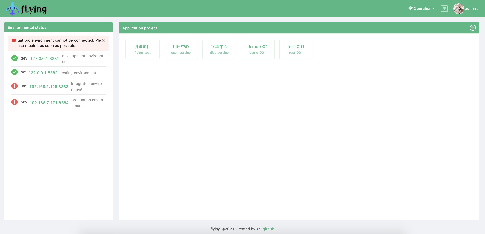

     

[Flying](https://github.com/ZhangChengJi/flying.git) 是微服务多环境云原生配置中心



> [English](README.md) | 中文

## 介绍

目前微服务架构方向逐渐向kubernetes 服务网格化靠拢，出现多环境多集群概念，Flying可以实现多集群微服务配置进行统一管理。

服务分为：

+ **flying-admin 管理端:**    管理界面，进行管理多个flying-config服务端的配置。主要是进行`环境`添加修改，`应用项目`管理，`命名空间`发布等功能。

+ **flying-config 服务端:**     真正的配置中心服务端，负责配置信息存储，推送客户端通知等。可以多环境部署。

+ **flying-client客户端:**   配置接收获取功能，实时更新配置等功能。目前只是实现Java客户端连接，后续会出现更多语言客户端。

## 功能描述 

+ 统一管理多环境多集群配置服务端
  + 直接通过管理界面一键配置多个环境服务端进行管理
  + 配置服务端无需重启管理端
+ 多服务端运行状态监控
  + 在多个环境的服务端连接时会实时显示连接运行状态

+ 配置热加载
  + 修改完成配置，发布之后,客户端在300毫秒内接收到新发布配置
+ 远程连接效率高
  + 全架构远程通信采用grpc连接 tls加密，高效且安全。可以自定义加密证书。


## 快速开始

**部署**

1. 克隆代码仓库

   ```shell
   $ git clone https://github.com/ZhangChengJi/flying.git
   ```

2. 启动服务

   在 flying 的根目录下，通过 docker-compose 创建服务

    ```shell
   $ docker-compose -f ./deployments/docker-compose/docker-compose.yaml up
    ```

通过上述命令，您可以从通过http://localhost:8888/ 访问，默认帐号: admin/123456

启动后通过管理端图形化界面配置环境连接服务端，注意docker默认网络是bridge，无法直接使用localhost:8881地址连接，请使用`flying-config:8881`或者`{本机ip}:8881`进行连接。

连接管理服务端的时候环境名称尽量按以下名称来定义。

- DEV

  - 开发环境

- FAT

  - 测试环境，相当于alpha环境(功能测试)

- UAT

  - 集成环境，相当于beta环境（回归测试）

- PRO

  - 生产环境

    

注意：docker-compose部署方式只是适用于测试，真正生产使用，请使用HA 数据库。

>管理端和服务端建议通过容器进行部署方便高效，在/deployments目录可以找到docker-compase和kubernetes的部署脚本。当然也是可以通过二进制进行部署。


**SDK 对接**

+ Java客户端

  1. 在自己的springboot项目中添加flying-client maven 包文件:

     ```xml
      <dependency>
     		<groupId>com.github.zhangchengji</groupId>
         <artifactId>flying-client</artifactId>
         <version>1.0.0</version>
      </dependency>
     ```

     导入成功

  2. 在springboot中把application.yml改成bootstrap.yml

  3. 在bootstrap.yml文件中添加配置：

     ```yml
     spring:
       profiles:
         active: ${ACTIVE:dev}   # 配置启动环境，如果环境变量$ACTIVE配置了环境名称那么默认使用$ACTIVE的
       flying:
         bootstrap:
           app-id: scaffold-user  #当前自己项目名称
           enabled: true          # 是否开启flying配置中心 默认为false
           refresh-enabled: true  # 是否开启实时配置更新   默认为false
           namespace: default     # 在服务端配置的当前项目配置信息的命名空间名称，可以有多个，多个逗号分隔
           address:               # 配置多个环境，启动时会根据spring.profiles.active环境名称进行选择环境加载配置
             - name: uat          # 环境名称
               url: flying-config.flying.svc:8881 #环境地址(服务端地址)
     ```

     

+ golang客户端

  未开发.....

## kubernetes 多环境

+ 在多个kubernetes集群中使用flying 配置中心时，建议只在内网/测试环境建立flying-admin管理端，然后通过专线或外网ip暴露每个集群里flying-config服务端的grpc加密连接地址。
+ 每个集群内部的微服务连接flying-config时，建议使用 kubernetes service属性名称连接，比如：`flying-config.flying.svc:8881`

## 执照

该项目已获得[Apache 2许可](https://github.com/ZhangChengJi/flying/blob/master/LICENSE)。

## 用户登记

> 欢迎用户在[https://github.com/ZhangChengJi/flying/issues/1中](https://github.com/ZhangChengJi/flying/issues/1)登记

|      |      |      |      |
| ---- | ---- | ---- | ---- |
|      |      |      |      |
|      |      |      |      |
|      |      |      |      |


## 联系我们

邮箱 380702562@qq.com

